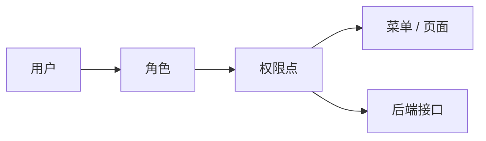
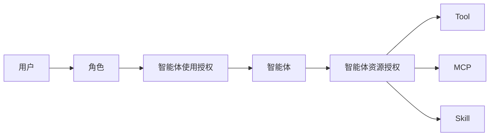

# Nexora AI Platform需求功能说明书

> 文档版本：v0.1  
> 更新时间：2026-05-26  
> 适用范围：Nexora AI Platform当前已完成的 QwenPaw 二开功能，以及后续需求迭代持续维护。  
> 文档定位：本说明书面向产品、研发、测试、运维管理和后续汇报场景，用于描述平台已实现功能、业务规则、权限逻辑、验收标准和后续规划。

## 1. 项目背景

Nexora AI Platform基于开源项目 QwenPaw 二次开发，目标是将 AI Agent 引入企业运维场景，使智能体能够在受控、安全、可审计的前提下调用现有运维工具。

QwenPaw 原项目已经提供聊天、智能体、工具、MCP、Skill、模型配置、会话等基础能力。本项目二开重点不是重复建设原有 Agent 能力，而是围绕企业运维平台的治理要求补齐以下能力：

- 登录认证与用户体系。
- 用户、角色、权限管理。
- 智能体使用授权。
- 智能体可调用工具、MCP、Skill 的授权管理。
- 工作区资源按权限过滤。
- 平台操作与登录审计。
- 运维平台菜单、品牌和中文化改造。
- 后续审批流、工具风险分级和生产化部署能力。

## 2. 建设目标

### 2.1 总体目标

建设一个面向智能运维的 AI Agent 管控平台，让用户可以通过 Web 控制台使用不同智能体，并让智能体在权限约束下调用 Tool、MCP、Skill 等运维能力。

### 2.2 阶段目标

当前阶段目标：

- 完成平台登录和基础用户体系。
- 完成用户权限与智能体权限两条权限路线。
- 完成菜单结构重组，使平台更符合运维管理场景。
- 完成审计日志基础能力，用于记录用户登录和平台操作。
- 完成工作区资源过滤，避免用户看到当前智能体无权使用的工具、MCP、Skill。
- 修复登录审计异常导致登录失败的问题，保证审计失败不阻断核心登录流程。

后续阶段目标：

- 完成审批流建设。
- 完成高危工具调用管控。
- 接入真实运维工具和企业内部系统。
- 完成审计日志持久化和查询分析能力增强。
- 完成外网发布、统一认证、生产部署和运维监控。

## 3. 用户角色

### 3.1 平台管理员

平台管理员负责系统基础治理和权限配置。

主要能力：

- 管理用户。
- 管理角色。
- 管理权限。
- 配置角色可使用的智能体。
- 配置智能体可调用的 Tool、MCP、Skill。
- 查看审计日志。
- 管理系统配置、模型配置和安全设置。

### 3.2 运维管理员

运维管理员负责运维场景下的智能体与工具治理。

主要能力：

- 查看用户和权限配置。
- 管理智能体。
- 管理工具、MCP、Skill。
- 查看审计日志。
- 后续可参与审批流配置和高危操作审批。

### 3.3 运维工程师

运维工程师是平台的主要使用者，通过被授权的智能体完成日常运维工作。

主要能力：

- 登录平台。
- 进入工作区。
- 使用被授权的智能体。
- 在智能体上下文中使用该智能体有权限的 Tool、MCP、Skill。
- 查看与自身工作相关的结果和会话。

### 3.4 只读观察员

只读观察员用于查看平台运行和审计信息，不承担变更执行职责。

主要能力：

- 登录平台。
- 查看允许访问的智能体或报表。
- 查看部分审计或统计信息。

## 4. 权限模型

当前平台采用两条权限路线。

### 4.1 用户权限路线

用户权限路线用于控制用户能访问哪些菜单、页面和后端接口。



说明：

- 用户通过角色获得权限点。
- 权限点决定前端菜单是否展示。
- 权限点也决定后端接口是否允许访问。
- 前端控制只用于体验优化，后端接口校验才是安全边界。

### 4.2 智能体权限路线

智能体权限路线用于控制用户可以使用哪些智能体，以及智能体可以调用哪些资源。



说明：

- 用户不直接获得工具使用权。
- 用户先通过角色获得智能体使用权。
- Tool、MCP、Skill 授权给智能体。
- 用户只能在已授权智能体中使用该智能体有权限的资源。
- 工作区内未授权资源不展示。

## 5. 菜单结构

当前菜单已按运维平台视角重组。

```text
工作区
  聊天
  智能体
  工具
  MCP
  Skill
  定时任务

智能报表
  智能体统计
  Token 消耗

控制
  渠道
  会话
  心跳

安全管理
  审批中心
  日志审计
  安全设置

权限管理
  用户权限
  智能体权限

设置
  模型
  环境变量
  备份恢复
  插件
```

菜单规则：

- `工作区` 是日常使用入口，聊天放在第一个。
- `权限管理` 默认展开，包含用户权限和智能体权限。
- `安全管理` 默认展开，包含审批中心、日志审计、安全设置。
- `智能报表` 默认展开，包含智能体统计和 Token 消耗。
- `设置` 默认折叠。
- Header 右上角展示当前登录用户名，并提供退出登录。

## 6. 已实现功能说明

### 6.1 中文化与品牌改造

功能说明：

- 平台界面已进行中文化处理。
- 登录页标题调整为 `The future starts now`。
- 平台 logo、favicon、浏览器标题已替换为Nexora AI 品牌。
- 原 QwenPaw 相关入口文案已逐步替换为平台化表达。

业务价值：

- 提升平台识别度。
- 降低内部用户使用门槛。
- 使系统从开源控制台形态转向企业内部平台形态。

验收标准：

- 登录页展示新标题。
- 浏览器标题展示Nexora AI Platform相关名称。
- 页面左上角展示Nexora AI logo。
- 主要菜单和管理入口为中文展示。

### 6.2 登录认证

功能说明：

- 平台已启用登录认证。
- 未登录用户访问受保护页面时跳转到登录页。
- 登录成功后进入目标页面或默认工作区。
- 支持退出登录。
- 支持 Header 展示当前登录用户名。

当前状态：

- 服务可在 `127.0.0.1:8088` 正常启动。
- 登录接口已验证返回正常。
- `admin` 与 `admin` 等账号可登录。
- `admin` 密码已完成重置；需求文档不记录明文密码。

验收标准：

- 未登录访问 `/users` 等管理页面时进入登录页。
- 使用有效账号密码可登录。
- 使用错误账号或密码无法登录。
- 登录后 Header 展示用户名。
- 点击退出登录后清除登录态并回到登录页。

### 6.3 用户管理

功能说明：

- 支持查看用户列表。
- 支持用户角色配置。
- 支持用户状态管理。
- 支持用户密码重置。
- 用户名已从中文调整为拼音账号，便于登录和系统集成。

当前用户示例：

```text
admin
admin
zhangming
huangmizhi
luyankun
wangshengquan
zouyumeng
luwenxing
zhangjiahe
liming
liuyang
```

验收标准：

- 管理员可以进入用户权限页面查看用户。
- 管理员可以调整用户角色。
- 用户密码重置后，新密码可登录，旧密码不可登录。
- 用户名不再包含中文字符。

### 6.4 角色管理

功能说明：

平台当前内置角色：

- `admin`：平台管理员。
- `ops_admin`：运维管理员。
- `operator`：运维工程师。
- `viewer`：只读观察员。

角色用于聚合权限点，并授权给用户。

验收标准：

- 管理员可以查看角色列表。
- 管理员可以查看角色拥有的权限点。
- 用户拥有不同角色时，菜单和接口访问能力不同。

### 6.5 权限管理

功能说明：

当前权限点覆盖以下能力：

```text
system.admin
users.manage
users.view
agents.manage
agents.use
tools.manage
tools.execute
models.manage
mcp.manage
audit.view
```

权限用于控制：

- 菜单展示。
- 页面访问。
- 后端 API 访问。
- 用户是否能管理系统配置、模型、工具、智能体和审计日志。

验收标准：

- 无权限用户不能进入管理页面。
- 无权限接口请求返回拒绝。
- 前端菜单与后端权限保持一致。

### 6.6 智能体权限

功能说明：

新增智能体权限管理能力，用于配置哪些角色可以使用哪些智能体。

设计规则：

- 用户通过角色获得智能体使用权。
- 智能体使用权独立于菜单权限。
- 未授权智能体不应对用户开放使用。
- 运维工程师如果没有被授权任何智能体，不应默认使用 `default` 智能体。

验收标准：

- 管理员可进入智能体权限页面。
- 管理员可配置角色可使用的智能体。
- 用户登录后只能看到或使用被授权的智能体。
- 未授权用户不能使用默认智能体绕过授权。

### 6.7 智能体资源授权

功能说明：

支持配置每个智能体可以调用哪些 Tool、MCP、Skill。

设计规则：

- Tool、MCP、Skill 授权对象是智能体，而不是直接授权给用户。
- 用户通过智能体间接使用工具能力。
- 当前智能体没有权限的资源，在工作区不展示。

验收标准：

- 管理员可配置某个工具可被哪些智能体调用。
- 管理员可配置某个 MCP 可被哪些智能体调用。
- 管理员可配置某个 Skill 可被哪些智能体调用。
- 保存授权配置后刷新页面仍然生效。
- 工作区只展示当前智能体有权限的资源。

### 6.8 工作区资源过滤

功能说明：

工作区中的工具、MCP、Skill 页面只展示当前智能体有权限使用的资源。

业务规则：

- 用户先选择智能体。
- 系统根据当前智能体加载资源权限。
- 未授权资源不展示。
- 后端后续应继续补齐执行侧拦截，避免只依赖前端隐藏。

验收标准：

- 切换智能体后，工具、MCP、Skill 列表随权限变化。
- 当前智能体未授权的资源不可见。
- 管理员修改授权后，刷新或重新进入页面生效。

### 6.9 日志审计

功能说明：

新增日志审计页面，用于查看平台关键操作记录。

当前已接入事件：

- 登录成功。
- 登录失败。
- 注册。
- API 变更类操作。
- API 权限拒绝。
- 会话 / 聊天相关操作。
- Agent 执行链路中的关键行为。

审计字段：

```text
id
timestamp
actor
action
resource_type
resource_id
status
ip
user_agent
detail
```

关键修复：

- 曾出现登录认证成功后，审计日志写入失败导致登录接口返回 `500` 的问题。
- 已修复为审计写入失败只记录 warning，不阻断登录主流程。

验收标准：

- 有权限用户可进入日志审计页面。
- 登录和操作行为能够形成审计记录。
- 审计日志写入异常时，不影响登录成功。
- 后续可按用户、动作、状态等维度查询。

### 6.10 菜单与导航调整

功能说明：

已根据运维平台使用习惯调整菜单结构：

- 聊天移动到工作区第一个。
- 定时任务移动到工作区。
- 智能体统计和 Token 消耗移动到智能报表。
- 收件箱改名为审批中心并移动到安全管理。
- 安全菜单改名为安全设置。
- 用户权限和智能体权限统一归入权限管理。
- 控制菜单整体下移到智能报表下面。

验收标准：

- 菜单结构符合第 5 章描述。
- 默认展开和折叠状态符合规则。
- 用户无权限时不展示对应管理入口。

## 7. 非功能需求

### 7.1 安全性

- 必须启用登录认证。
- 后端接口必须进行权限校验。
- 密码以哈希形式存储，不保存明文。
- 审计日志不应记录密码、API Key 等敏感信息。
- 后续外网访问必须使用 HTTPS 和访问认证。

### 7.2 可审计性

- 登录、权限拒绝、关键 API 操作、智能体执行行为应记录审计。
- 审计异常不应阻断核心业务。
- 后续需要支持审计日志导出和长期存储。

### 7.3 可维护性

- 二开代码优先放入独立扩展目录。
- 尽量减少对 QwenPaw 原生核心代码的侵入。
- 后续同步上游时，优先检查路由挂载、菜单注册和权限中间件改动点。

### 7.4 可扩展性

- 权限点可继续扩展。
- 智能体资源授权可继续扩展到更多资源类型。
- 审批流可按工具风险等级扩展。
- 工具接入可支持 CLI、API、MCP、Skill 多种方式。

## 8. 当前验收清单

| 模块 | 验收项 | 状态 |
| --- | --- | --- |
| 登录认证 | 未登录跳转登录页 | 已实现 |
| 登录认证 | 有效账号可登录 | 已验证 |
| 登录认证 | 退出登录入口在右上角 | 已实现 |
| 用户管理 | 用户列表展示 | 已实现 |
| 用户管理 | 中文用户名改为拼音 | 已完成 |
| 用户管理 | `admin` 密码重置 | 已完成 |
| 角色管理 | 内置角色展示 | 已实现 |
| 权限管理 | 用户 -> 角色 -> 菜单 / 接口权限 | 已实现 |
| 智能体权限 | 角色 -> 智能体授权 | 已实现 |
| 资源授权 | 智能体 -> Tool / MCP / Skill 授权 | 已实现 |
| 工作区 | 资源按当前智能体权限过滤 | 已实现 |
| 审计日志 | 登录和平台操作记录 | 已实现基础能力 |
| 审计日志 | 审计失败不阻断登录 | 已修复 |
| 菜单导航 | 运维平台菜单重组 | 已实现 |
| 品牌中文化 | Logo、标题、菜单中文化 | 已实现 |

## 9. 后续需求规划

### 9.1 审批流

目标：对高危工具调用进行审批控制。

规划能力：

- 工具配置风险等级。
- 高危工具调用自动进入审批中心。
- 审批人可通过或拒绝。
- 审批结果写入审计日志。
- Agent 在审批完成后继续或终止任务。

### 9.2 工具风险治理

目标：对不同运维工具建立统一风险模型。

规划能力：

- 只读工具默认低风险。
- 普通变更工具需要权限控制。
- 高危工具需要审批。
- 生产环境工具需要更严格审批策略。

### 9.3 审计日志增强

目标：提升审计可查询、可追踪、可留存能力。

规划能力：

- 审计日志持久化到 SQLite / PostgreSQL / 日志平台。
- 支持按时间、用户、动作、资源、状态筛选。
- 支持导出。
- 支持异常操作告警。

### 9.4 运维工具接入

目标：接入现有运维系统。

优先级建议：

1. 日志查询。
2. 监控告警查询。
3. CMDB 查询。
4. CI/CD 查询与发布。
5. Kubernetes 查询与变更。
6. 云资源查询与变更。

### 9.5 生产化部署

目标：从本地开发环境走向可对外访问和可持续运行。

规划能力：

- Cloudflare Tunnel 或正式反向代理。
- HTTPS。
- Cloudflare Access 或企业 SSO。
- 服务进程守护。
- 数据备份。
- 监控告警。
- 多环境隔离。

## 10. 风险与约束

| 风险 | 说明 | 应对方式 |
| --- | --- | --- |
| 上游代码更新冲突 | QwenPaw 后续升级可能影响二开挂载点 | 二开代码独立目录化，减少核心文件改动 |
| 前端隐藏不等于安全 | 只做前端资源过滤可能被绕过 | 后端执行链路继续补齐权限校验 |
| 审计本地文件可靠性有限 | JSONL 文件不适合长期生产审计 | 后续迁移到数据库或日志平台 |
| 工具调用风险高 | AI Agent 可能触发变更类操作 | 引入风险等级、审批流和审计追踪 |
| 外网暴露风险 | 直接暴露本地服务存在安全风险 | 使用 HTTPS、Access、SSO、白名单 |

## 11. 版本记录

| 版本 | 日期 | 说明 |
| --- | --- | --- |
| v0.1 | 2026-05-26 | 初版，记录当前已实现的二开功能、权限体系、审计能力和后续规划 |

## 12. 总结

当前二开已经完成平台治理的基础框架：登录认证、用户角色权限、智能体授权、工具资源授权、工作区资源过滤、审计日志和菜单品牌改造。

后续建设重点应从“平台基础治理”进入“运维动作治理”，即围绕真实工具接入、高危操作审批、审计留存和生产化部署继续迭代。
