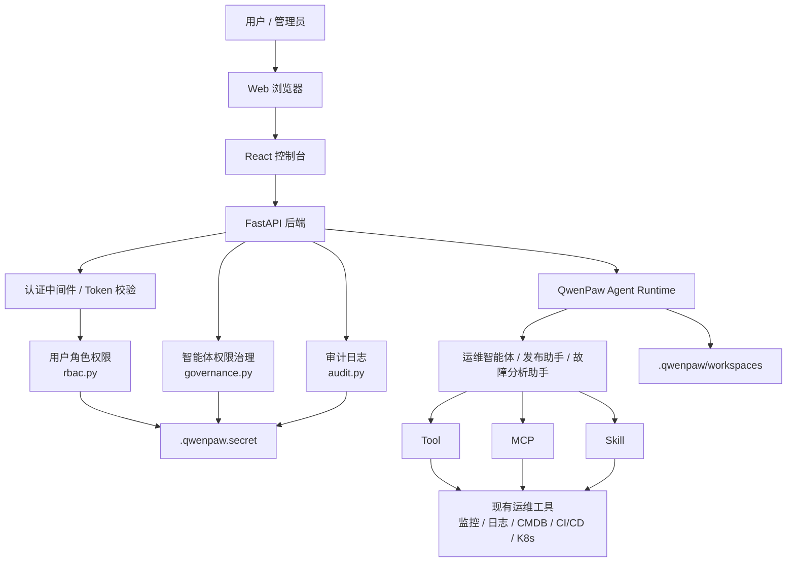
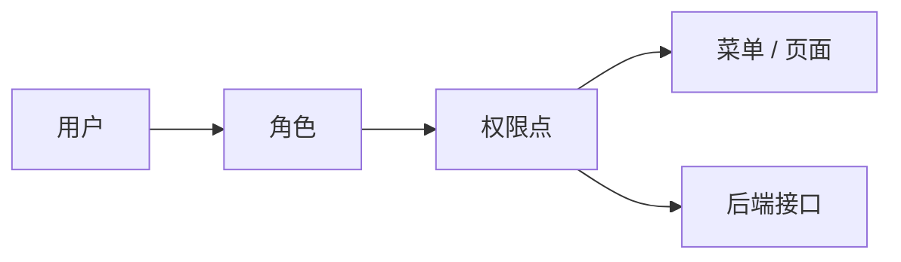
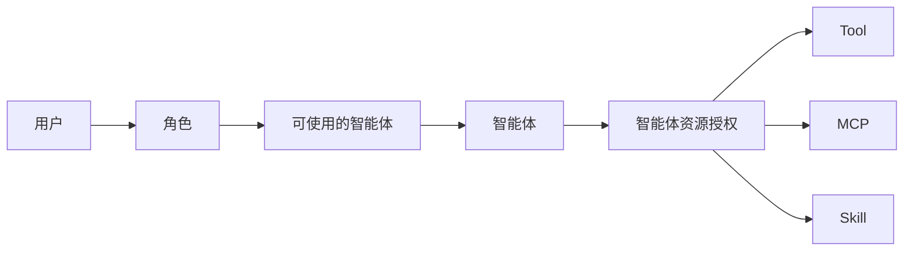
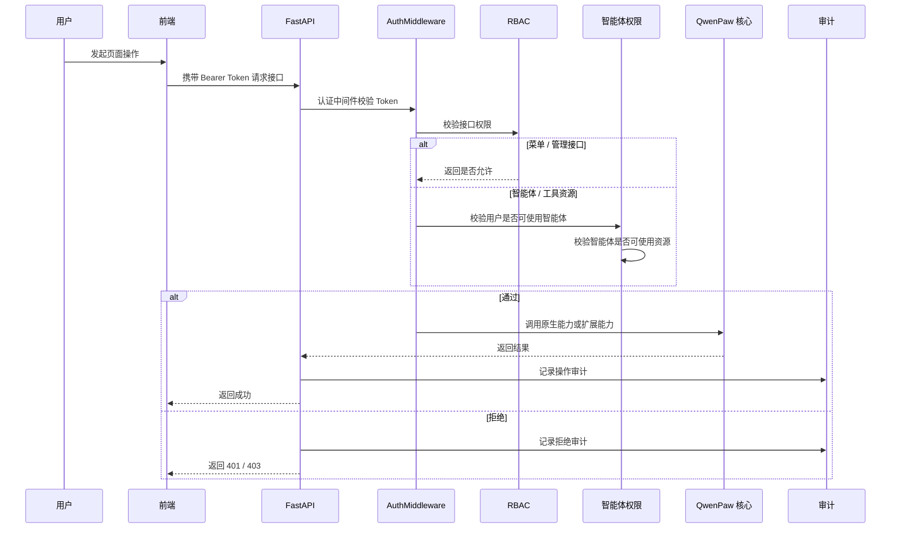
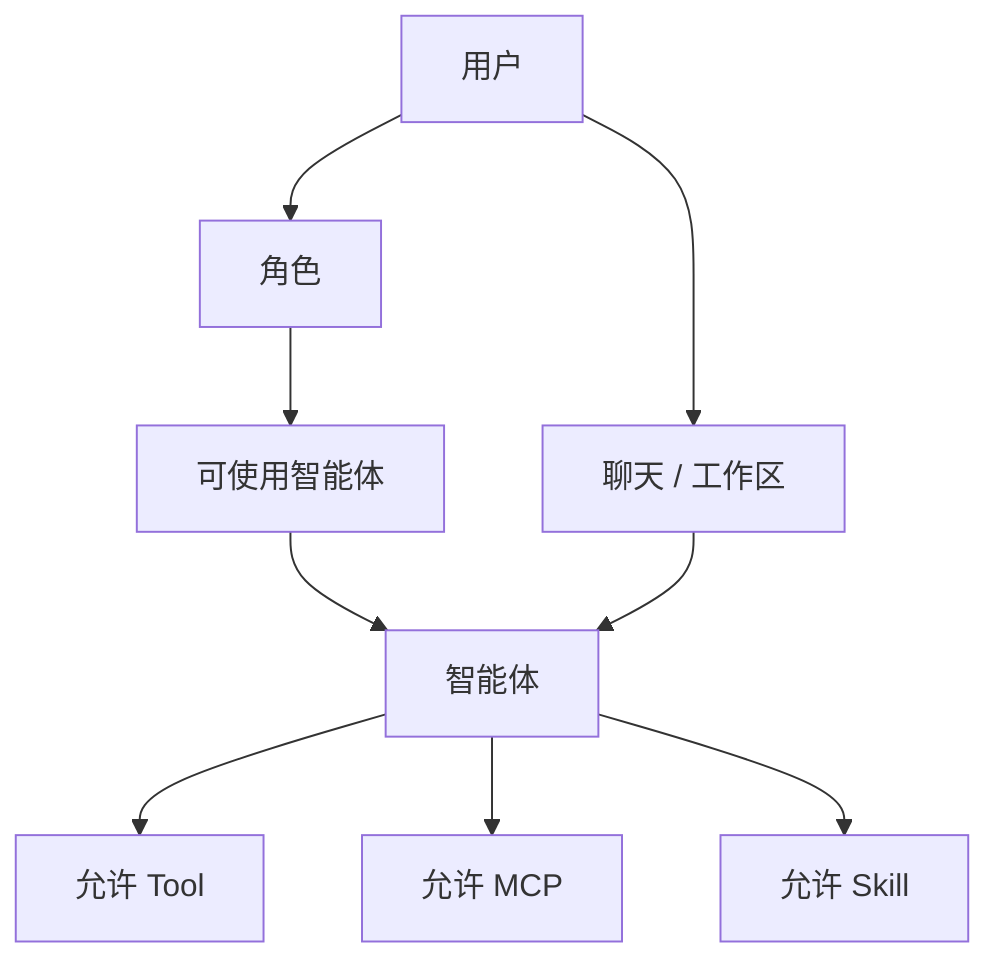
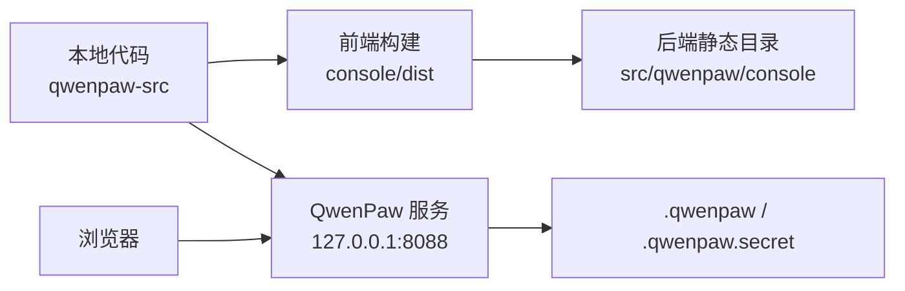
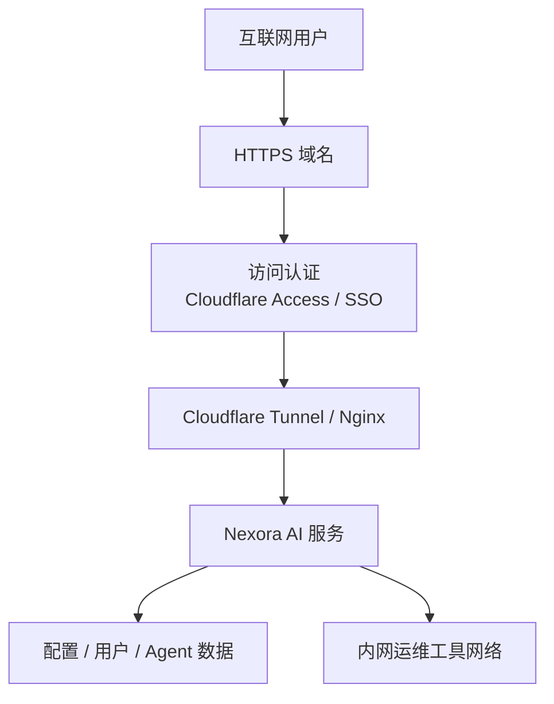

# Nexora AI Platform技术方案

> 更新时间：2026-05-26。本文档已根据当前二开进展更新，覆盖用户权限、智能体权限、审计日志、菜单结构与登录审计容错修复。

## 1. 项目定位

Nexora AI Platform基于开源项目 QwenPaw 二次开发，目标是建设一个面向智能运维场景的 AI Agent 调度与治理平台。

平台不是重新建设一套 Agent 系统，而是在 QwenPaw 已有能力上补齐企业运维平台需要的登录认证、用户体系、权限体系、智能体授权、工具治理、审计日志和后续审批能力。

核心目标：

- 提供 Web 控制台，支持登录、用户管理、角色管理和权限治理。
- 以智能体作为 Tool、MCP、Skill 的主要使用载体。
- 通过 CLI、API、MCP、Skill 等方式接入现有运维工具。
- 让传统运维工具能够被 AI Agent 安全调用。
- 对用户登录、平台操作、智能体使用、工具调用等行为进行审计。
- 尽量保持二开代码独立，降低后续同步 QwenPaw 上游更新的成本。

## 2. 建设原则

本项目采用“上游核心 + Nexora 扩展层”的建设方式。

- QwenPaw 原项目作为 Agent 和控制台底座，尽量复用原生能力。
- 二开功能优先放入 `qwenpaw_ext/nexora` 和 `console/src/nexora`。
- 原项目文件只保留必要挂载点，例如路由注册、菜单注册、权限中间件接入。
- 不重复建设 QwenPaw 已有的聊天、智能体、模型、Skill、MCP、工具、会话等基础能力。
- 工具治理按“智能体可用资源”设计，不直接把工具授权给用户。
- 菜单访问按“用户 -> 角色 -> 菜单/接口权限”设计。
- 所有关键操作应具备权限控制和审计记录；审计失败不能阻断主流程。

## 3. 当前项目结构

```text
qwenpaw-src/
  console/
    src/
      api/                         # QwenPaw 原生前端 API
      pages/                       # QwenPaw 原生页面
      layouts/                     # 菜单、布局、Header
      stores/                      # 智能体等前端状态
      nexora/                    # Nexora AI 前端扩展
        api/
          audit.ts                 # 审计日志 API
          governance.ts            # 智能体权限 / 工具治理 API
        pages/
          AuditLogs/               # 日志审计页面
          OpsGovernance/           # 智能体权限页面
          UserManagement/          # 用户权限页面
        utils/                     # 权限与资源过滤工具
    public/
      logo.png                     # Nexora AI logo
      logo-icon.svg                # favicon

  src/
    qwenpaw/                       # QwenPaw 原生后端代码
      app/
        auth.py                    # 认证中间件、API 权限拦截挂载点
        routers/
          auth.py                  # 登录、用户、角色、权限接口
          agents.py                # 智能体接口，已接入授权过滤
          nexora.py              # Nexora 扩展路由挂载
          console.py               # 会话相关接口，已接入审计
        runner/
          api.py                   # Agent 执行链路，已接入审计
      console/                     # 前端构建产物，由后端托管

    qwenpaw_ext/
      nexora/
        audit.py                   # 审计日志写入与查询
        governance.py              # 智能体与工具 / MCP / Skill 授权关系
        rbac.py                    # 用户、角色、权限与 API 权限策略

  docs/
    technical-solution.md          # 本技术方案
  CUSTOMIZATION.md                 # 二开范围、升级方式、托管说明
  start-qwenpaw-zh.sh              # 中文化启动脚本
```

## 4. 技术架构

平台采用前后端一体化部署：

- 前端：React、TypeScript、Ant Design。
- 后端：Python、FastAPI、Uvicorn。
- Agent 底座：QwenPaw 原生 Agent Runtime。
- 工具生态：QwenPaw 原生 Tool、MCP、Skill。
- 二开扩展：Nexora RBAC、智能体权限、资源过滤、审计日志。
- 本地数据：`~/.qwenpaw` 保存运行配置、工作区、Agent 数据；`~/.qwenpaw.secret` 保存用户认证和审计等敏感数据。

### 4.1 系统架构图



## 5. 权限总体设计

当前权限体系分成两条主线。

### 5.1 用户权限路线

用于控制用户能访问哪些菜单、页面和平台接口。



示例：

- `admin`：平台管理员，可访问用户权限、智能体权限、安全设置、审计日志等管理能力。
- `operator`：运维工程师，默认只拥有智能体使用能力，不直接拥有系统配置和工具管理能力。

### 5.2 智能体权限路线

用于控制每个智能体可以调用哪些 Tool、MCP、Skill。



当前设计重点：

- 用户不直接使用工具，用户先被授权使用某些智能体。
- 工具、MCP、Skill 授权给智能体。
- 工作区页面只展示当前智能体有权限的工具、MCP、Skill。
- 未授权资源在界面上不可见，后端也应继续拦截。

## 6. 菜单与页面规划

当前菜单按运维平台视角重新组织：

```text
工作区
  聊天
  智能体
  工具
  MCP
  Skill
  定时任务

智能报表
  智能体统计
  Token 消耗

控制
  渠道
  会话
  心跳

安全管理
  审批中心
  日志审计
  安全设置

权限管理
  用户权限
  智能体权限

设置
  模型
  环境变量
  备份恢复
  插件
```

菜单折叠策略：

- `权限管理` 默认展开。
- `智能报表` 默认展开。
- `安全管理` 默认展开。
- `设置` 默认折叠。
- 工作区作为主要使用区域，聊天放在第一个入口。
- Header 右上角展示当前登录用户名，并提供退出登录。

## 7. 前端设计

已复用的 QwenPaw 原生能力：

- 聊天页
- 智能体管理
- 工具管理
- MCP 管理
- Skill 管理
- 定时任务
- 模型配置
- 环境变量
- 安全设置
- Token 用量
- 智能体统计
- 收件箱能力，已在菜单中命名为审批中心

Nexora AI 前端扩展：

```text
console/src/nexora/
  api/
    audit.ts
    governance.ts
  pages/
    AuditLogs/
    OpsGovernance/
    UserManagement/
  utils/
```

已实现能力：

- 用户管理
- 角色管理
- 权限点管理展示
- 智能体权限配置
- 智能体可用 Tool / MCP / Skill 配置
- 工作区资源按当前智能体权限过滤
- 日志审计页面
- Header 用户名展示
- 退出登录入口

前端通过 `/api/auth/me` 获取当前用户、角色和有效权限。前端权限用于菜单展示和资源过滤，真正安全边界仍由后端 API 校验。

## 8. 后端设计

QwenPaw 原生后端承担：

- Web 服务启动
- 静态前端托管
- 登录认证中间件
- Agent 运行
- 聊天会话
- MCP、Tool、Skill 原生管理
- 工作区管理

Nexora 扩展后端：

```text
src/qwenpaw_ext/nexora/
  rbac.py
  governance.py
  audit.py
```

职责：

- `rbac.py`：用户、角色、权限点、接口权限映射。
- `governance.py`：角色到智能体授权、智能体到工具 / MCP / Skill 授权。
- `audit.py`：审计事件写入、查询、过滤。

### 8.1 后端权限流程



## 9. 审计日志设计

审计日志用于记录用户登录平台、使用平台、操作智能体、智能体调用工具等行为。

当前已接入审计事件：

- 登录成功 / 登录失败
- 注册
- API 变更类操作
- API 权限拒绝
- 会话 / 聊天相关操作
- Agent 执行链路中的关键行为

审计字段：

```text
id
timestamp
actor
action
resource_type
resource_id
status
ip
user_agent
detail
```

本阶段已修复一个关键问题：

- 登录认证成功后会写审计日志。
- 如果审计文件因本地权限问题写入失败，不能阻断登录。
- 当前 `record_audit_event` 已调整为：写入失败只记录 warning，主流程继续返回。

后续建议把审计从本地 JSONL 升级为 SQLite、PostgreSQL 或统一日志平台。

## 10. Agent 与工具治理设计

工具、MCP、Skill 是智能体的能力资源，不直接暴露给普通用户。



工作区过滤流程：

1. 前端读取当前用户可用智能体。
2. 用户选择一个智能体。
3. 前端请求工具、MCP、Skill 列表。
4. 前端只展示该智能体有权限的资源。
5. 后端执行时再次检查智能体资源授权。

工具风险分层：

- 只读查询类：日志查询、告警查询、CMDB 查询、发布记录查询。
- 普通变更类：服务重启、扩缩容、配置变更、发布操作。
- 高危操作类：生产数据库变更、批量删除、权限变更、核心系统回滚。

后续高危操作需要接入审批中心。

## 11. 登录认证现状

当前认证启用方式：

- 启动脚本 `start-qwenpaw-zh.sh` 默认设置 `QWENPAW_AUTH_ENABLED=true`。
- 登录页标题已调整为 `The future starts now`。
- 品牌 logo、favicon、页面标题已替换为Nexora AI 风格。
- 右上角展示当前登录用户名。
- 退出登录入口放在页面右上角。

当前已验证：

- 服务可在 `127.0.0.1:8088` 正常启动。
- 登录接口返回 `200`。
- 登录问题根因已定位为审计日志写入权限导致接口 `500`，现已通过审计容错修复。

当前可用管理员账号：

```text
admin
```

密码由本地认证文件保存为哈希，不在方案文档中记录明文。

## 12. 部署架构

本地开发部署：



本地启动：

```bash
QWENPAW_PORT=8088 ./start-qwenpaw-zh.sh
```

外网访问部署：



推荐生产环境增加：

- HTTPS。
- Cloudflare Access 或公司 SSO。
- IP 白名单。
- 服务进程守护。
- 审计日志持久化到数据库或日志平台。
- 配置和密钥备份。
- 私有 GitHub 仓库和发布分支。

## 13. Git 与上游同步策略

当前建议保持两个远端：

- `origin`：Nexora AI 自有仓库。
- `upstream`：QwenPaw 原开源仓库。

推荐分支：

- `main`：稳定可运行版本。
- `develop`：日常开发版本。
- `feature/*`：单个功能开发。
- `sync/upstream-YYYYMMDD`：同步上游临时分支。

同步流程：

```bash
git fetch upstream
git checkout main
git checkout -b sync/upstream-YYYYMMDD
git merge upstream/main
```

每次同步重点验证：

- 登录页。
- 用户权限。
- 智能体权限。
- 聊天页。
- 工具、MCP、Skill 列表过滤。
- 日志审计。
- 模型配置。
- 前端构建。
- 后端启动。

## 14. 当前完成情况

已完成：

- 中文化与品牌替换。
- 登录页改造。
- 登录认证启用。
- 用户管理、角色管理、权限管理。
- 菜单结构重组。
- Header 用户名展示与退出登录。
- 用户 -> 角色 -> 菜单 / 接口权限路线。
- 用户 -> 角色 -> 智能体 -> Tool / MCP / Skill 权限路线。
- 智能体权限页面。
- 工作区资源按智能体权限过滤。
- 日志审计页面。
- 登录审计容错修复。
- 服务已在 `127.0.0.1:8088` 验证可启动，登录接口返回正常。

待增强：

- 审计日志持久化从本地 JSONL 升级为 SQLite / PostgreSQL / 日志平台。
- 后端工具执行链路继续补全细粒度审计。
- 高危工具审批流程。
- 工具风险等级、环境等级、审批策略配置。
- 企业 SSO / Cloudflare Access。
- 自动化测试与发布流程。

## 15. 后续路线图

### 第一阶段：基础治理闭环

- 完善用户、角色、菜单、接口权限。
- 完善智能体授权。
- 完善资源过滤和后端拦截。
- 固化二开目录规范。

### 第二阶段：审计与安全

- 扩展登录、页面操作、接口操作、Agent 操作审计。
- 审计日志查询、过滤、导出。
- 将审计日志持久化到更可靠存储。
- 增加安全策略配置。

### 第三阶段：审批流

- 高危工具调用进入审批中心。
- 支持审批通过、拒绝、超时、撤回。
- 审批记录进入审计日志。
- Agent 执行前根据策略自动判断是否需要审批。

### 第四阶段：运维工具接入

- 接入日志查询。
- 接入监控告警。
- 接入 CMDB。
- 接入 CI/CD 查询与发布能力。
- 接入 Kubernetes 和云资源查询能力。

### 第五阶段：生产化部署

- Cloudflare Tunnel 或正式反向代理。
- HTTPS 与统一身份认证。
- 服务进程守护。
- 数据备份恢复。
- 监控告警。
- 多环境隔离。

## 16. 总结

Nexora AI Platform当前已经从“QwenPaw 二开界面”进入“具备企业运维治理雏形的平台”阶段。

当前架构的核心是：

- QwenPaw 负责 Agent、聊天、工具、MCP、Skill 等基础能力。
- Nexora 扩展层负责用户权限、智能体授权、资源治理、审计日志和后续审批。
- 权限体系按两条线建设：用户权限控制平台访问，智能体权限控制工具使用。
- 二开代码尽量独立，后续可以更平滑地合并上游更新。
