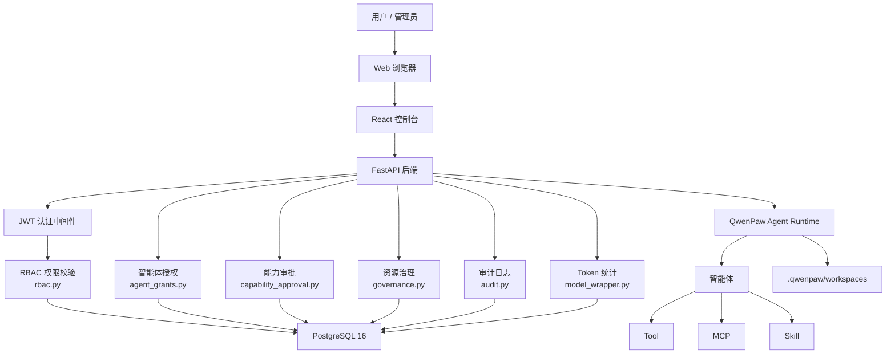
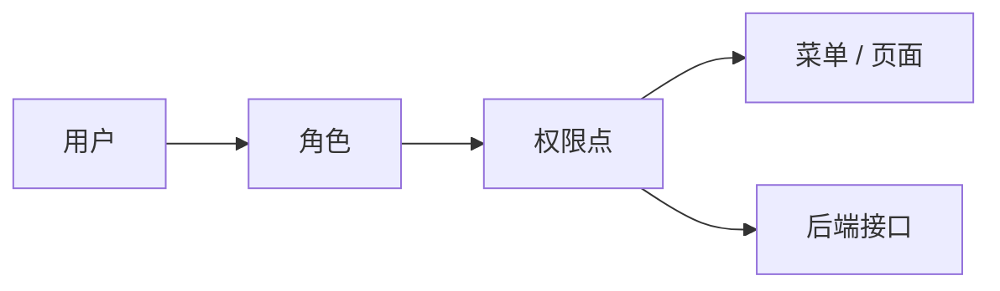
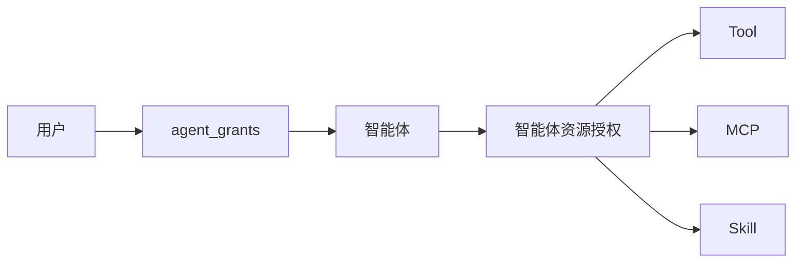
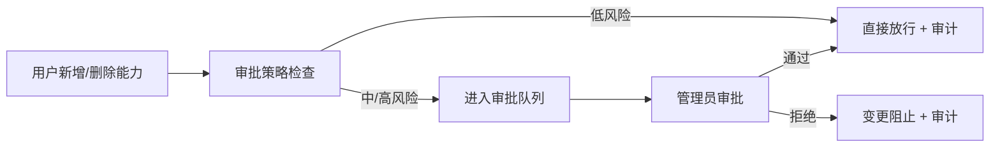
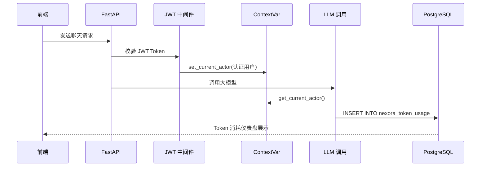
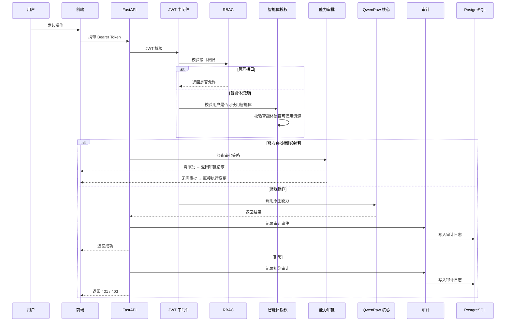
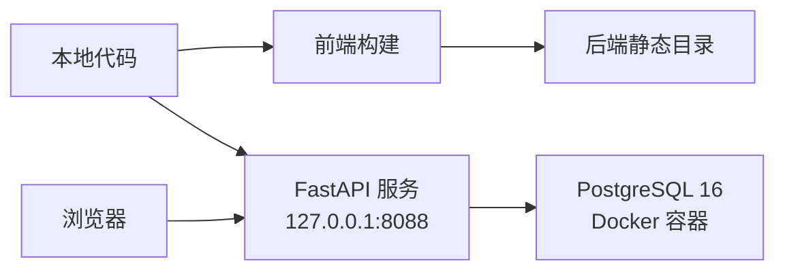
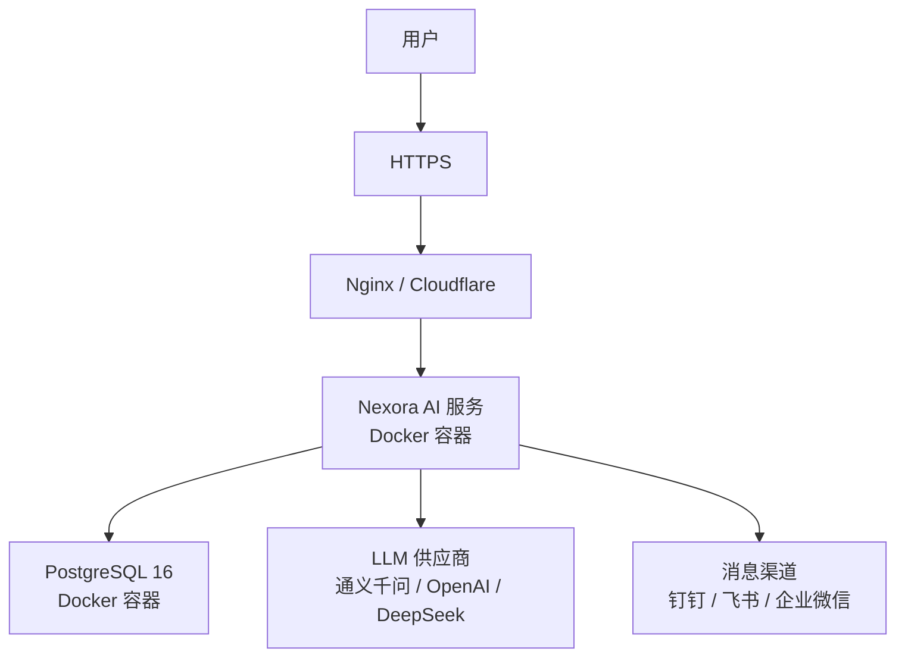

# Nexora AI Platform 技术方案

> 更新时间：2026-05-30

## 1. 项目定位

Nexora AI Platform 基于开源项目 QwenPaw 二次开发，目标是建设面向企业级场景的 AI Agent 调度与治理平台。

平台不是重新建设一套 Agent 系统，而是在 QwenPaw 已有能力上补齐企业平台需要的：

- 登录认证与 JWT 会话管理
- 多租户用户体系与 RBAC
- 智能体授权与能力审批
- 工具治理与安全防护
- 全链路审计日志
- Token 消耗统计与分析
- PostgreSQL 持久化存储

核心目标：

- 提供 Web 控制台，支持登录、用户管理、角色管理和权限治理
- 以智能体作为 Tool、MCP、Skill 的主要使用载体
- 通过 CLI、API、MCP、Skill 等方式接入现有运维工具
- 让传统运维工具能够被 AI Agent 安全调用
- 对用户登录、平台操作、智能体使用、工具调用等行为进行全链路审计
- 按用户、智能体、模型维度追踪 Token 消耗
- 尽量保持二开代码独立，降低后续同步 QwenPaw 上游更新的成本

### 1.1 设计规模

- **用户规模**：至少 100 个并发用户，覆盖管理员和操作员两类角色
- **智能体规模**：至少 100 个智能体，支持按需懒加载、空闲回收、LRU 淘汰
- **存储要求**：所有业务数据使用 PostgreSQL 持久化
- **权限粒度**：三层权限模型（平台访问 → 智能体授权 → 能力审批）
- **审计合规**：全链路审计日志满足企业合规要求

## 2. 建设原则

本项目采用"上游核心 + Nexora 扩展层"的建设方式：

- QwenPaw 原项目作为 Agent 和控制台底座，复用原生能力
- 二开功能优先放入 `qwenpaw_ext/nexora` 和 `console/src/nexora`
- 原项目文件只保留必要挂载点（路由注册、菜单注册、权限中间件接入）
- 不重复建设 QwenPaw 已有的聊天、智能体、模型、Skill、MCP、工具等基础能力
- 工具治理按"智能体可用资源"设计，不直接把工具授权给用户
- 所有关键操作具备权限控制和审计记录；审计失败不阻断主流程
- 所有业务数据存储使用 PostgreSQL，禁止 JSON 文件存储

## 3. 项目结构

```text
nexora-ai-platform/
  console/
    src/
      api/                           # QwenPaw 原生前端 API
        modules/
          tokenUsage.ts              # Token 消耗 API（含按用户统计）
        types/
          tokenUsage.ts              # Token 消耗类型定义
      pages/                         # QwenPaw 原生页面
        Settings/
          TokenUsage/                # Token 消耗统计页面（含按用户维度）
      layouts/                       # 菜单、布局、Header
      stores/                        # 智能体等前端状态
      nexora/                        # Nexora 前端扩展
        api/
          audit.ts                   # 审计日志 API
          governance.ts              # 智能体权限 / 工具治理 API
          multiTenant.ts             # 多租户管理 API
        pages/
          AuditLogs/                 # 日志审计页面
          OpsGovernance/             # 智能体权限页面
          UserManagement/            # 用户权限页面
        utils/                       # 权限与资源过滤工具
    public/
      logo.png                       # 平台 logo
      logo-icon.svg                  # favicon

  src/
    qwenpaw/                         # QwenPaw 原生后端代码
      app/
        auth.py                      # 认证中间件、JWT 校验
        agent_context.py             # ContextVar（当前用户/智能体追踪）
        routers/
          auth.py                    # 登录、用户、角色、权限接口
          agents.py                  # 智能体接口，已接入授权过滤
          nexora.py                  # Nexora 扩展路由挂载
          console.py                 # 会话相关接口，已接入审计和用户追踪
          _capability_approval.py    # 能力审批 API
        runner/
          runner.py                  # Agent 执行链路
      token_usage/
        model_wrapper.py             # Token 消耗记录（含 PG 写入）
      console/                       # 前端构建产物

    qwenpaw_ext/
      nexora/
        rbac.py                      # 用户、角色、权限与 API 权限策略
        audit.py                     # 审计日志写入与查询
        agent_grants.py              # 用户-智能体授权关系
        agent_templates.py           # 智能体模板管理
        authorization.py             # 授权引擎
        capability_approval.py       # 能力审批策略与执行
        governance.py                # 智能体与工具/MCP/Skill 授权关系
        db.py                        # PostgreSQL 连接与表结构管理
        repositories/                # 数据访问层（全部 PostgreSQL）
          auth_postgres.py           # 用户认证存储
          agent_grants_postgres.py   # 智能体授权存储
          agent_templates_postgres.py
          approval_postgres.py       # 审批请求存储
          audit_postgres.py          # 审计日志存储
          capability_approval_postgres.py
          config_postgres.py         # 运行时配置存储
          governance_postgres.py     # 治理策略存储

  tests/
    unit/nexora/                     # 扩展模块单元测试（96 passed）
    load/locustfile.py               # 100 用户并发压力测试
    contract/                        # 契约测试
    integration/                     # 集成测试

  alembic/                           # 数据库版本化迁移
    versions/
      0001_nexora_audit_approval.py
      0002_nexora_runtime_config.py
      0003_nexora_multi_tenant.py
      0004_nexora_capability_approval_policy_enum.py

  docs/                              # 项目文档
  deploy/                            # Docker 部署配置
```

## 4. 技术架构

平台采用前后端一体化部署：

- **前端**：React + TypeScript + Ant Design + Vite
- **后端**：Python + FastAPI + Uvicorn
- **数据库**：PostgreSQL 16
- **Agent 底座**：QwenPaw 原生 Agent Runtime
- **工具生态**：QwenPaw 原生 Tool、MCP、Skill
- **二开扩展**：Nexora RBAC、智能体授权、能力审批、资源治理、审计日志、Token 统计

### 4.1 系统架构图



## 5. 权限体系设计

权限体系分三层，形成完整的访问控制链路：

### 5.1 第一层：平台访问权限

控制用户能访问哪些菜单、页面和平台接口。



角色设计：

- `admin`：平台管理员，可访问用户管理、智能体授权、审计日志、安全设置等全部管理能力
- `operator`：操作员，默认只拥有智能体使用能力，不直接拥有系统配置和工具管理权限

### 5.2 第二层：智能体授权

控制每个用户可以使用哪些智能体（agent_grants 表）。



- 用户不直接使用工具，用户先被授权使用某些智能体
- 工具、MCP、Skill 授权给智能体
- 工作区页面只展示当前智能体有权限的资源
- 未授权资源在界面上不可见，后端也拦截

支持批量授权和撤销操作，适配 100 用户规模。

### 5.3 第三层：能力审批

用户安装或卸载能力（工具、技能、MCP 服务器、插件）时，通过策略引擎进行审批管控。



触发审批的操作类型：skill.create / skill.delete、mcp.create / mcp.delete、tool.create / tool.delete、plugin.install / plugin.uninstall、acp.create / acp.delete。

审批策略可按能力类型、风险等级、环境等级配置。审批结果记录审计日志。

## 6. 数据存储设计

所有业务数据使用 PostgreSQL 持久化，通过 Alembic 管理表结构迁移。

### 6.1 核心表结构

| 表名 | 用途 |
|------|------|
| `nexora_users` | 用户账号（用户名、密码哈希、角色、状态） |
| `nexora_audit_events` | 审计日志（操作者、动作、资源、状态、IP、详情） |
| `nexora_approval_requests` | 审批请求（能力新增/删除、风险等级、审批结果） |
| `nexora_agent_grants` | 用户-智能体授权关系 |
| `nexora_agent_templates` | 智能体模板 |
| `nexora_governance` | 智能体资源治理策略 |
| `nexora_capability_policies` | 能力审批策略 |
| `nexora_runtime_config` | 运行时配置 |
| `nexora_token_usage` | Token 消耗记录（日期、用户、智能体、模型、token 数） |

### 6.2 Token 消耗追踪

Token 消耗通过 ContextVar 机制追踪当前认证用户：



Token 记录写入使用后台守护线程，不阻塞主请求。按用户、智能体、模型、日期四个维度聚合，支持前端可视化分析。

## 7. 菜单与页面结构

```text
工作区
  聊天
  智能体
  工具
  MCP
  Skill
  定时任务

智能报表
  智能体统计
  Token 消耗（含按用户统计）

控制
  渠道
  会话
  心跳

安全管理
  审批中心
  日志审计
  安全设置

权限管理
  用户权限
  智能体权限

设置
  模型
  环境变量
  备份恢复
  插件
```

## 8. 前端设计

### 8.1 复用 QwenPaw 原生能力

- 聊天页（含 Coding 模式）
- 智能体管理
- 工具 / MCP / Skill 管理
- 定时任务
- 模型配置
- 环境变量
- 安全设置
- 智能体统计
- 收件箱（审批中心）

### 8.2 Nexora 扩展能力

- 用户管理（CRUD、角色分配、批量操作）
- 角色管理
- 智能体授权配置（按用户分配可用智能体）
- 智能体可用 Tool / MCP / Skill 配置
- 工作区资源按当前智能体权限过滤
- 日志审计页面（分页、过滤、检索）
- Token 消耗按用户统计表格
- Header 用户名展示与退出登录

前端通过 `/api/auth/me` 获取当前用户、角色和有效权限。前端权限用于菜单展示和资源过滤，安全边界由后端 API 校验。

## 9. 后端设计

### 9.1 后端权限流程



### 9.2 审计日志设计

已接入审计事件：

- 登录成功 / 登录失败
- 用户注册
- API 变更操作
- API 权限拒绝
- 聊天消息发送 / 重连 / 停止
- 文件上传
- Agent 执行链路关键行为
- 审批请求创建 / 审批 / 拒绝
- 智能体授权变更
- 配置变更

审计字段：

| 字段 | 说明 |
|------|------|
| id | 唯一标识 |
| timestamp | 事件时间 |
| actor | 操作者 |
| action | 操作类型 |
| resource_type | 资源类型 |
| resource_id | 资源标识 |
| status | success / failure |
| ip | 客户端 IP |
| user_agent | 客户端信息 |
| detail | 操作详情（JSON） |

所有审计日志存储在 PostgreSQL `nexora_audit_events` 表，支持分页查询和多条件过滤。

## 10. 部署架构

### 10.1 开发环境



### 10.2 生产环境



推荐生产环境配置：

- HTTPS + Nginx 或 Cloudflare
- PostgreSQL 独立部署或容器化
- 数据卷持久化
- 服务进程守护
- 日志轮转
- 定期备份

## 11. Git 与上游同步策略

保持两个远端：

- `origin`：Nexora 自有仓库
- `upstream`：QwenPaw 原开源仓库

推荐分支：

- `main`：稳定可运行版本
- `develop`：日常开发
- `feature/*`：单个功能开发
- `sync/upstream-YYYYMMDD`：同步上游临时分支

同步后验证清单：

- 登录 / 退出
- 用户权限管理
- 智能体授权
- 聊天功能
- 工具 / MCP / Skill 列表过滤
- 审计日志
- Token 消耗统计
- 模型配置
- 前端构建
- 后端启动
- Docker 构建

## 12. 已完成功能清单

| 模块 | 功能 | 状态 |
|------|------|------|
| 品牌 | 中文化、logo、页面标题替换 | 已完成 |
| 认证 | JWT 登录、Token 校验、退出登录 | 已完成 |
| RBAC | 用户管理、角色管理（admin/operator） | 已完成 |
| 智能体授权 | agent_grants 表、批量授权/撤销 | 已完成 |
| 能力审批 | 审批策略、审批队列、管理员审批 | 已完成 |
| 资源治理 | 智能体可用 Tool/MCP/Skill 配置 | 已完成 |
| 审计日志 | PostgreSQL 存储、分页查询、多条件过滤 | 已完成 |
| Token 统计 | 按用户/智能体/模型/日期统计、可视化仪表盘 | 已完成 |
| 数据库 | PostgreSQL 全量迁移、Alembic 版本管理 | 已完成 |
| Docker | Dockerfile、docker-compose、健康检查 | 已完成 |
| 测试 | 单元测试 96 passed、100 用户压力测试 | 已完成 |

## 13. 后续路线图

### 近期

- JWT Secret 迁移 PostgreSQL
- 聊天页智能体选择体验优化
- SSO / LDAP / OIDC 接入评估

### 中期

- 运维工具接入（日志查询、监控告警、CMDB）
- 审计日志留存策略与归档
- 多环境隔离

### 远期

- CI/CD 与 Kubernetes 查询能力
- 多实例高可用部署
- 操作审计大屏

## 14. 总结

Nexora AI Platform 已从"QwenPaw 二开界面"进入"具备企业级治理能力的 AI 工作台"阶段。

当前架构核心：

- QwenPaw 负责 Agent、聊天、工具、MCP、Skill、Coding 等基础能力
- Nexora 扩展层负责用户权限、智能体授权、能力审批、资源治理、审计日志、Token 统计
- 三层权限模型：平台访问 → 智能体授权 → 能力审批
- 全部业务数据存储在 PostgreSQL，通过 Alembic 管理迁移
- 二开代码独立隔离，可平滑合并上游更新
